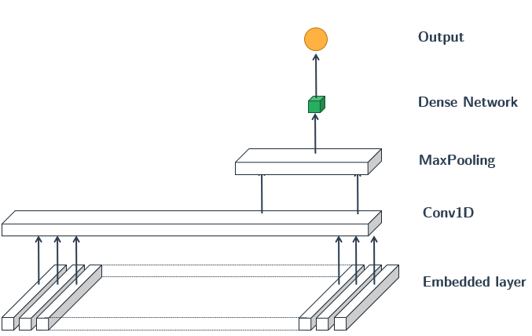

# Predicting Stock Movement Using News Headlines 

## Introduction 

The purpose of this project is to explore the probability of using most discussed world news headlines to predict the selected stock movement (up or down).

### About the Dataset 

The dataset consists of 1989 observations: top 25 daily news headlines as well as the Dow Jones Industrial Average (DJIA) movement index from Auguest 8, 2008 to July 1, 2016. The news headlines are scraped from **World News** *subreddit* on Reddit.com, and the DJIA movement is directly obtained from Yahoo Finance. 

Reddit is an online community where users share their opinions about various subjects, from politics, science to daily lives. In the World News subreddit, users discuss the latest happenings around the world outside the United States.

*Screenshot of worldnews subreddit on Reddit.com*

Dow Jones Industrial Average (DJIA) is considered to be one of the representative measures of the US stock market besides S&P500, . It takes the sum of the largest 30 listed companies stock prices and divide it by a normalization factor. DIJA includes companies from various industries in the United States, namely Apple, 3M, Goldman Sachs and so on. 

## Methodologies

First, text preprocessing is performed, including text normalization, removing special tags, removing punctuation, removing digits and so on. Concentrations, stop words, text stemming and lemmatization are not performed as it is found that without these steps, the prediction result is higher. Then, the dataset is split into training set (before 2015-01-01) and testing set (after 2014-12-31) based on the dates, which is roughly 80 to 20 ratio. Some simple EDA is performed as well, such as world clouds and topic modeling. Next, the processed text headlines are combined into one blob and converted into numeric representation using three techniques: count vectorizer, Tfidf, and GloVe embeddings. Last, both machine learning and deep learning techniques are applied.   

The overall process can be summarized into the following flowchart:

*Flowchart of training models*

## Machine Learning Models 

The result is described as follows:

|                     | uni-gram | bi-gram | tri-gram | Tfidf & uni-gram | Tfidf & bi-gram | Tfidf & tri-gram | customized Tfidf |
|---------------------|:--------:|:-------:|:--------:|:----------------:|:---------------:|:----------------:|:----------------:|
| Logistic regression |   0.429  |  0.563  |   0.511  |       0.489      |      0.508      |       0.508      |       0.569      |
| Random Forest       |     -    |  0.508  |     -    |         -        |        -        |         -        |       0.524      |
| AdaBoost            |     -    |    -    |     -    |         -        |        -        |         -        |       0.532      |
| XGBoost             |     -    |    -    |     -    |         -        |        -        |         -        |       0.516      |

The ROC curve for the `Logistic Regression + customized Tfidf` model:

From the ROC curve, it is observed that the model is overfitted: having a training AUC much higher than the testing set. The test accuracy is slightly better than a straight line. Overall, the performance of the model is below satisfactory. 

## Deep Learning Models 

Two types of neural networks are tested: Recurrent Neural Networks and Convolutional Neural Networks. The first two models consist of RNN and CNN respectively and the last model is a combination of the two. 

### RNN model

*structure of the LSTM model, GRU is a simplied version of LSTM*

Results:

|    Model   |                     Variants                     | Accuracy score |
|:----------:|:------------------------------------------------:|:--------------:|
| LSTM (RNN) | Default                                          | 0.5159         |
| LSTM (RNN) | learning rate = 0.005                            | 0.5238         |
| LSTM (RNN) | dropout = 0.2                                    | 0.5132         |
| LSTM (RNN) | dropout = 0.2, reccurent dropout = 0.2           | 0.4815         |
| LSTM (RNN) | 2 LSTM Layers                                    | 0.5132         |
| LSTM (RNN) | optimizer = Nadam                                | 0.4894         |
| GRU (RNN)  | Default                                          | 0.5026         |
| GRU (RNN)  | optimizer = Nadam                                | 0.4894         |

*Result of the default LSTM model*

### CNN model

*structure of the CNN model*

Results:

|    Model   |                     Variants                     | Accuracy score |
|:----------:|:------------------------------------------------:|:--------------:|
| CNN        | filters=32, kernel_size=5                        | 0.5079         |
| CNN        | filters=64, kernel_size=5                        | 0.4603         |
| CNN        | filters=100, kernel_size=5                       | 0.5            |
| CNN        | filters=32, kernel_size=3                        | 0.5026         |
| CNN        | filters=32, kernel_size=2                        | 0.4841         |

*Result of `CNN filters=10, kernel_size=5`*

### Hybrid model

*structure of the CNN+LSTM model*

Results:

|    Model   |                     Variants                     | Accuracy score |
|:----------:|:------------------------------------------------:|:--------------:|
| CNN + LSTM | filters=32, kernel_size=5                        | 0.5079         |
| CNN + GRU  | filters=32, kernel_size=5                        | 0.5106         |
| CNN + GRU  | filters=32, kernel_size=5, learning_rate = 0.005 | 0.5            |
| CNN + GRU  | filters=10, kernel_size=5, learning_rate = 0.005 | 0.5265         |
| CNN + GRU  | filters=10, kernel_size=5, learning_rate = 0.007 | 0.4868         |

*Result of `CNN+GRU filters=10, kernel_size=5, learning_rate = 0.005`*

## Conclusion 

In this project, the deep learning models has a lower performance than the baseline model (logistic regression) despite having a more complex structure, and the accuracy being very close to 50% implies that the result could well be a random guess. This may lead to a conclusion that the selected stock movement is independent from the selected news headlines. To check the validity of the model, I have also applied these models on a different dataset (IMDB movie reviews) and the accuracy is close about 88% without hyperparameter tuning, the models no longer suffer from overfitting despite being much larger. From the previous analysis using word clouds and topic modeling, it is obvious that the main focus of these news are mainly politics related to keywords such as Israel, Russia, and China, which may have little impact on the Dow Jones stock index. 

In the future projects, the following can be tried:

- using financial news 
- adding lags into the result

## Reference 

- Géron, A. (2017). Hands-on machine learning with Scikit-Learn and TensorFlow : concepts, tools, and techniques to build intelligent systems. Sebastopol, CA: O'Reilly Media. ISBN: 978-1491962299
- Lane, H., Howard, C., Hapke, H. (2019) Natural Language Processing in Action. Manning Publications. ISBN: 9781617294631
- Alzazah, Faten & Cheng, Xiaochun. (2020). Recent Advances in Stock Market Prediction Using Text Mining: A Survey. 10.5772/intechopen.92253. 